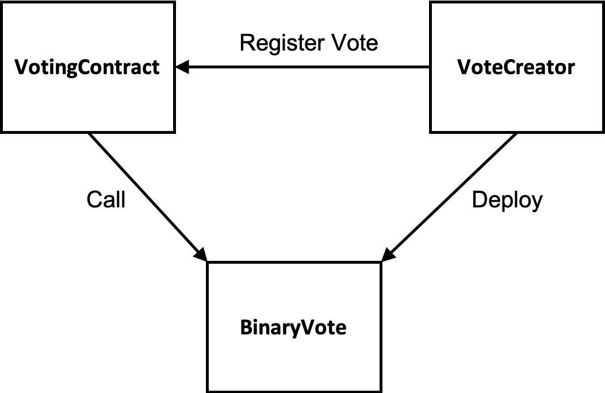

# A Privacy-Preserved Voting Protocol

## Introduction

This project implements the voting protocol described in `protocol.md`. There are three contracts:

* `BinaryVote` - implements a single vote where voters are only allowed to cast a **YES** or **NO** ballot;
* `VotingContract` - responsible for hosting multiple votes and executing requests from users to call functions of a deployed `BinaryVote` contract.
* `VoteCreator` - responsible for creating new votes through deploying `BinaryVote` and registering the instance in `VotingContract`.

Their relationships have been illustrated by the figure below. 

## Pros and Cons of the Voting Protocol

### Pros
* Ballot privacy - no one except the voting authority knows the ballot contents.
* Ballot verifiable
	* Voters can verify the existence of their ballots.
	* Anyone can verify the validity of a recorded ballot.
	* Recorded ballots are immutable. 
* Tally results universally verifiable
	* Anyone can verify that all and only the valid ballots have been tallied.
	* Anyone can verify the correctness of the tally results.
* Voters are allowed to cast multiple times and the newer ballot will replace the previous one cast by the same voter.

### Cons
* The voting authority has to be trusted to keep ballot privacy and conduct timely tallying.

## Voting Process
The following is the whole voting process:

1. The voting authority creates a new vote via `VoteCreator.newBinaryVote`. The ID of the created vote is compted by `keccak256(authority_address, deployed_contract_address)`.
2. The voting authority generates a key pair for the vote and register the public key via `VotingContract.setAuthPubKey`.
3. Voters upload their ballots via `VotingContract.cast`.
4. The voting authority ends the casting period via `VotingContract.beginTally`.
5. The voting authority off-chain computes the tally result and upload the result via `VotingContract.setTallyRes`.
6. The voting authority ends the tally period via `VotingContract.endTally`.
7. Anyone can verify the result via `VotingContract.verifyTallyRes`. They can also verify individual ballot via `VotingContract.verifyBallot`.

`./test/testVotingContract.js` implements the code for testing a complete voting process.

## Limitations

The implementation is created as a prototype of a privacy-preserved voting system. Therefore, it does not include features such as timing control and voter registration that are commonly seen in a typical voting process. The system currently only supports the vote where voters cast YES/NO ballots.